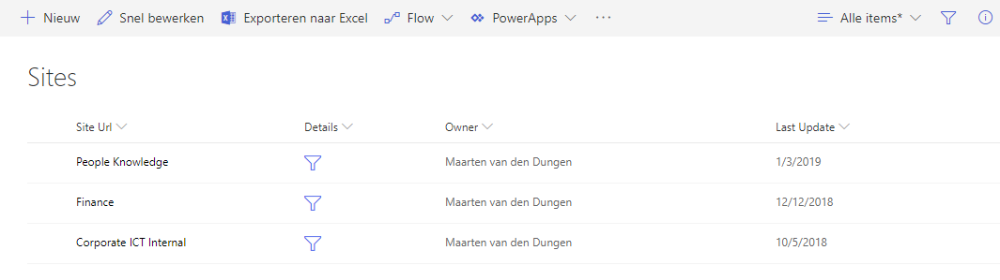

# Add filter links for header/details lists

Sometimes you create 2 lists that are connected via a lookup column. Since modern lists still do not support connections, there is no suitable way to show the connected lists. In order to overcome this 'problem' I created a column formatting that mimics the connected web parts feature, just by using column formatting.



## List Requirements

- To use the formatting on a field that will not interfere with the New, Edit or Display forms, we added a **calculated field**, called `Details`, that return a **single line of text**.
- Within the formula of the calculated field you can just specify something like `="dummy"`. This field will hold the filter for the details or connected list.

## Adding the Column Formatting JSON Code

To add the column formatting code, follow the steps below:
1. Create the `Details` field in a custom list as descibed above
2. In the column `Details` dropdown, choose _Column Settings > Format current column_

> In the JSON code, replace the placeholder `[Url To View in Connected List]` with the URL to the connected list, including the view. Replace the placeholder `[Connected Field Name]` with the field name where to filter on.

3. Paste the JSON code from the **filter-link-sample.json** file into the panel
4. Choose _Preview_ to show a sample of the new formatted column, note: the formatted column is not saved yet, closing the panel will discard all changes you made without confirmation!
5. Choose _Save_ to make it available for the end user

Clicking on the 'Filter' icon, will open the specified URL behind it, showing a filter.

## How does it work

If you set a filter on a list, the URL is changed with several parts. If you analyse this URL, the only thing that changes is the `FilterValue` part in the URL. Let's assume that you have a list containing a text field called `SiteName`. Filtering on that field will change the URL as follow (for the sake of the example we split the URL over multiple lines):

```
/allitems.aspx?useFiltersInViewXml=1
    &FilterField1=SiteName
    &FilterType1=Text
    &FilterOp1=In
    &FilterValue1=SomeSiteName
```
The only variable in this URL is the field `FilterValue1`. In the JSON code we just add the variable from the header list as variable in the URL and open the link in a new window. Clicking the `Details` column item will open the connected list with filter.

## DISCLAIMER
> THIS CODE IS PROVIDED AS IS WITHOUT WARRANTY OF ANY KIND, EITHER EXPRESS OR IMPLIED, INCLUDING ANY IMPLIED WARRANTIES OF FITNESS FOR A PARTICULAR PURPOSE, MERCHANTABILITY, OR NON-INFRINGEMENT.
