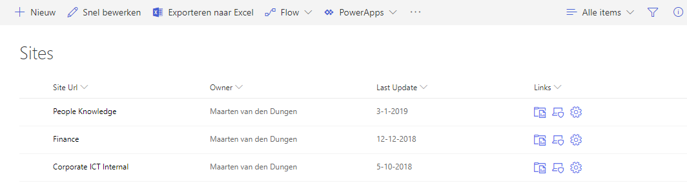

# Add icon links

Let's assume that you are working on a migration project and you have a custom list **Sites** containing all sites that will be migrated to a new environment. The list contains a site URL and some other meta data about users and status. How often will you open the site to view the site contents, settings or security...?

This example shows you how you can extend the list with 3 icons that will open the site contents, site settings or the site security immediately from the site listing. It will save many clicks to get you were you want to be.

## List Requirements

- The list **must contain** a field called `SiteUrl` (hyperlink field type). The bases of the column formatting JSON code is based on this field. Note that we need to name it **internally** `SiteUrl`, how you display the name in the list is up to you.

- To use the formatting on a field that will not interfere with the New, Edit or Display forms, we added a **calculated field**, called `Links`, that return a **single line of text**. Within the formula of the calculated field you can just specify something like `="dummy"`. 

## Adding the Column Formatting JSON Code

To add the column formatting code, follow the steps below:
1. Create the `SiteUrl` and `Links` fields in a custom list as descibed above
2. In the column `Links` dropdown, choose _Column Settings > Format current column_
3. Paste the JSON code from the **settings-links.json** file into the panel
4. Choose _Preview_ to show a sample of the new formatted column, note: the formatted column is not saved yet, closing the panel will discard all changes you made without confirmation!
5. Choose _Save_ to make it available for the end user

Clicking on one of the icons, will open the specified URL behind it. An easy way to quickly open Site Content, Site Settings or the Site Security from the site.

## DISCLAIMER
> THIS CODE IS PROVIDED AS IS WITHOUT WARRANTY OF ANY KIND, EITHER EXPRESS OR IMPLIED, INCLUDING ANY IMPLIED WARRANTIES OF FITNESS FOR A PARTICULAR PURPOSE, MERCHANTABILITY, OR NON-INFRINGEMENT.